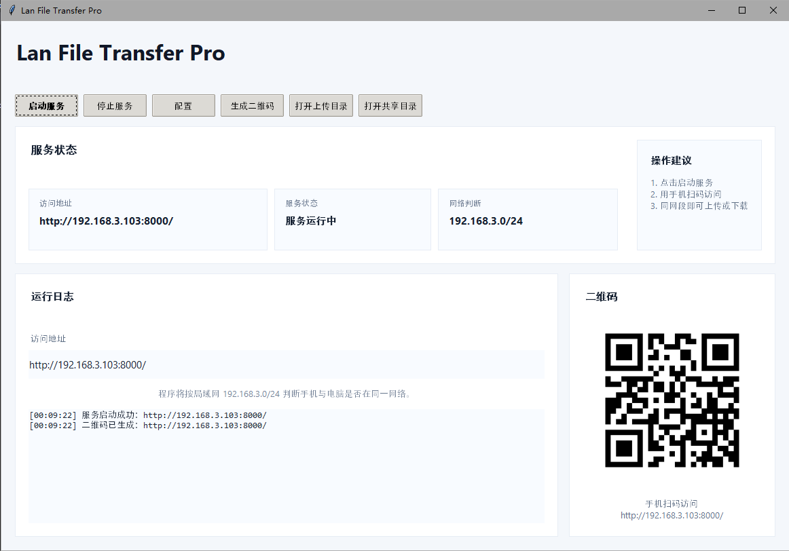
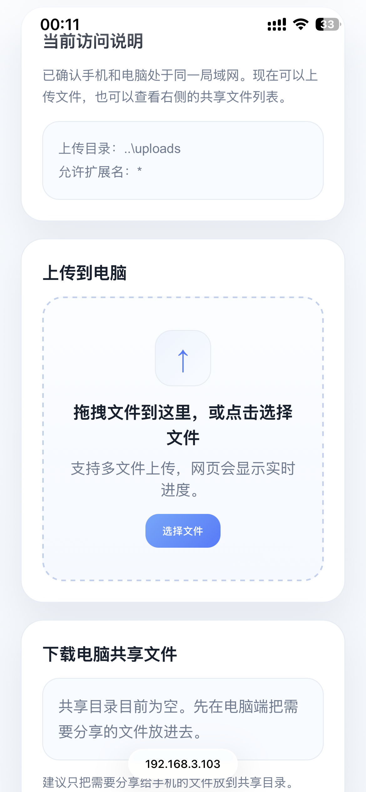

# Lan File Transfer Pro

一个适合 Windows 桌面端使用的局域网文件传输工具。电脑端提供明亮简洁的桌面界面，手机端扫码进入网页后，可以在同一局域网内上传文件到电脑，也可以下载电脑共享目录中的文件。


---

## 功能特性

- 桌面端可配置常用传输参数
- 手机扫码访问网页
- 自动判断手机与电脑是否在同一局域网
- 手机上传文件到电脑
- 手机下载电脑共享目录文件
- 上传进度条
- 网页拖拽上传
- 配置面板默认隐藏，界面干净清爽
- 支持打包成 Windows exe

---

## 项目预览

```md


```

---

## 项目结构

```text
LanFileTransferPro/
├─ main.py
├─ requirements.txt
├─ build_exe.bat
├─ LanFileTransferPro.spec
├─ .gitignore
├─ README.md
├─ assets/
│  ├─ app.ico
│  └─ .gitkeep
└─ config.json

# 运行后会在 exe 同目录自动生成
# uploads/
# shared_files/
```

---

## 安装运行

### 1. 安装依赖

```bash
pip install -r requirements.txt
```

### 2. 启动程序

```bash
python main.py
```

---

## Windows 打包

### 方式一：双击脚本

直接运行：

```text
build_exe.bat
```

### 方式二：命令行

```bash
pyinstaller LanFileTransferPro.spec --clean
```

打包完成后，主程序通常在：

```text
dist/LanFileTransferPro.exe
```

---

## 使用说明

### 桌面端

1. 启动程序
2. 点击“配置”展开设置
3. 二维码显示 IP 可填 `auto`，程序每次启动会自动读取当前电脑 IP
4. 上传目录和共享下载目录默认都相对 exe 自动创建，也可以手动改到其他位置
5. 点击“启动服务”
6. 点击“生成二维码”
7. 把想让手机下载的文件放到共享目录，或点击“导入共享文件”

### 手机端

1. 扫描二维码
2. 程序会判断手机是否与电脑处于同一局域网
3. 若是同一局域网：
   - 可上传文件到电脑
   - 可下载电脑共享文件
4. 若不是同一局域网：
   - 页面提示先连接同一 Wi‑Fi

---

## 常见问题

### 1. 手机扫二维码打不开？

通常有 3 个原因：

- 二维码中的 IP 不是电脑的局域网 IP
- Windows 防火墙拦截了端口
- 手机和电脑不在同一个 Wi‑Fi

### 2. 为什么提示不在同一局域网？

程序会根据：

- 电脑 IP
- 子网掩码
- 手机访问时的客户端 IP

来判断是否同网段。

### 3. 手机端拖拽上传为什么有时不可用？

拖拽能力取决于手机浏览器。多数手机浏览器更适合点击后选择文件。

### 4. 为什么换电脑后配置还能正常保存？

因为 `config.json` 不再打进 exe，程序会把配置固定保存在 exe 同目录。

### 5. 为什么没有 H 盘也能运行？

因为默认上传目录和共享目录都改成了相对 exe 的 `uploads` 和 `shared_files`，程序会自动创建。

---

## 后续建议

后续可以继续扩展：

- 传输记录表格
- 文件搜索
- 批量删除上传记录
- 深色 / 浅色主题切换
- 自定义品牌图标
- 安装包（Inno Setup）

---

## License

Apache License

